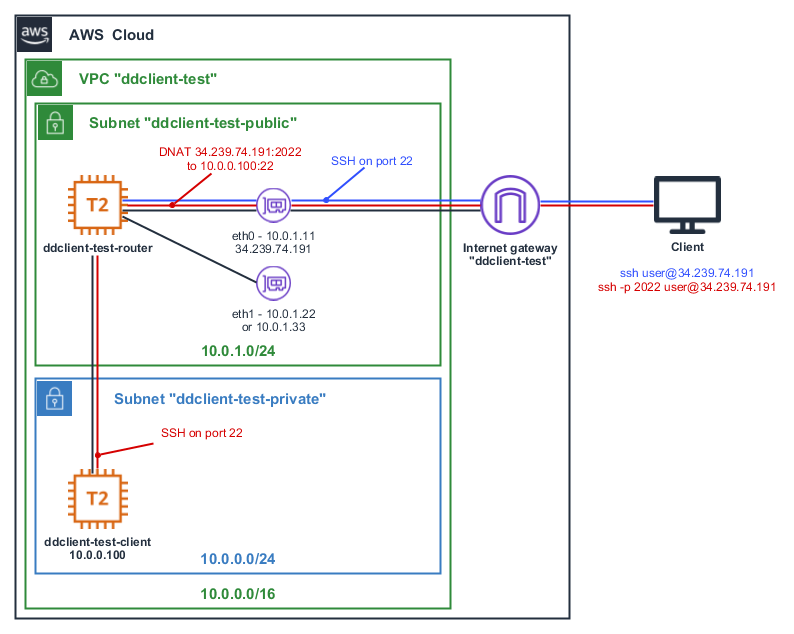
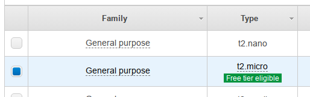

This directory contains scripts that manage testing infrastructure in Amazon
VPC.

### Contents

* [Overview](#overview)
* [Notes](#notes)
* [Initial Setup](#initial-setup)
* [Usage Examples](#usage-examples)
* [Useful Links](#useful-links)

### Overview

Network diagram for the VPC



### Notes

This VPC is used solely for the purpose of testing **multi-ip-ddclient** in different
operating systems. It should not be used in a production environment.

* It has relaxed security: ssh ports accessible from anywhere both
for public and private subnets, default user names with passwordless sudo
are used.
* Secondary network interface is not usable. It is present only to emulate
IP address change.
* :warning: External IP address is lost on 'ddclient-test-router' instance
restart. After that the VPC becomes inaccessible from the outside.

### Initial Setup

1. All scripts expect that AWS shared config and credentials files are properly
set up. It could be done either with AWS CLI
```shell
# Interactively
aws configure
# Using set command
aws configure set aws_access_key_id default_access_key
aws configure set aws_secret_access_key default_secret_key
aws configure set default.region us-west-2
```
or by manually editing `~/.aws/credentials` and `~/.aws/config` files.

2. AWS account, that is used to run scripts, has to have active subscriptions to
Ubuntu 16.04, Ubuntu 18.04, CentOS 6 and CentOS 7 AMIs:
* Ubuntu 16.04: https://aws.amazon.com/marketplace/pp/B01JBL2M0O
* Ubuntu 18.04: https://aws.amazon.com/marketplace/pp/B07CQ33QKV
* CentOS 6: https://aws.amazon.com/marketplace/pp/B00NQAYLWO
* CentOS 7: https://aws.amazon.com/marketplace/pp/B00O7WM7QW
<br/>Subscriptions management:
* https://console.aws.amazon.com/marketplace/home?region=us-east-1#/subscriptions
* https://aws.amazon.com/marketplace/library?ref_=header_user_your_software
-----
All used AMIs are free tier eligible at the time of writing. There is no
automated way to check if it is still the case. To check manually use the
following command to list AMI IDs:
```shell
./run_instance.py --list-ami-ids
```
Then go to EC2 Dashboard in AWS console and click the `Launch Instance` button.
Enter AMI ID in the search field and press <kbd>Enter</kbd>. Select appropriate
image and make sure that 't2.micro' instance type has a `Free tier eligible`
label like in the example below:<br/>


### Usage Examples

```ssh
./create_vpc.py
./run_instance.py
./run_instance.py -c
./execute_on_client.py script_that_expects_eth1_to_fail.sh
./change_eth1_ip.py
./execute_on_client.py script_that_expects_first_ip_on_eth1.sh
./change_eth1_ip.py
./execute_on_client.py script_that_expects_second_ip_on_eth1.sh
./terminate_instances.py
./delete_vpc.py
```

### Useful Links

* https://boto3.amazonaws.com/v1/documentation/api/latest/reference/services/ec2.html
* https://docs.aws.amazon.com/vpc/latest/userguide/VPC_Scenarios.html
* https://aws.amazon.com/premiumsupport/knowledge-center/ec2-centos-rhel-secondary-interface/